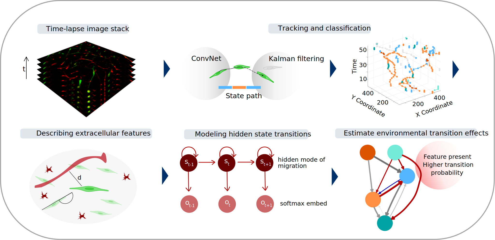
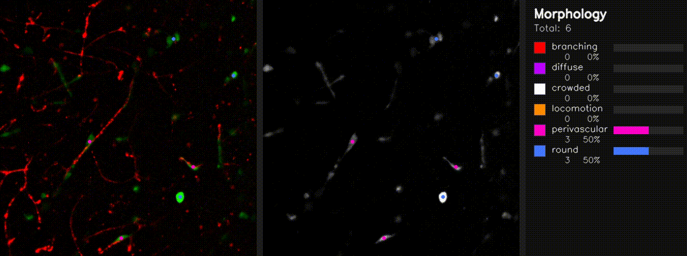

# GlioTrace: AI-Driven Glioblastoma Invasion Mapping in Live Brain Slices
GlioTrace is a novel ex vivo imaging and AI-based analytical framework that enables real-time, spatiotemporal tracking of cell migration dynamics in patient-derived glioma cell culture xenograft (PDCX) brain slices. The computational framework, written in MATLAB and made available in this repository, enables tracking and classification of migrating cells in real time, preceded by video registration, stabilization and region selection. From the extensive data collection generated by the cell tracking and classifcation, the framework generates statistics on cell migration and cell phenotypic changes over time and in response to therapy.

  

## Whole-specimen imaging of PDCX brain slices
Brain slices are kept alive and imaged for up to six days, enabling long-term observations of cell invasion dynamics.

  

## Multi-object tracking coupled to changes in cell morphology
GlioTrace captures invasion dynamics of individual cells and registers cell morphology at each time step.
Here, colors represent the different morphologies assigned by a convolutional neural network.

  

 

## GlioTrace framework overview

Preprocessing and analysis of image data happens in a discrete set of steps using the functions provided in this repo.

# Installation

Clone the repository, then install from the repository root:

`pip install .`

The package can now be used under name of *gliotrace*. Checkout the Example in the root directory for correct function calls.

## Contact

For questions, contact Madeleine (madeleine.skeppas@igp.uu.se), André (andrelas@chalmers.se), or Linnea (hallinl@chalmers.se) !
